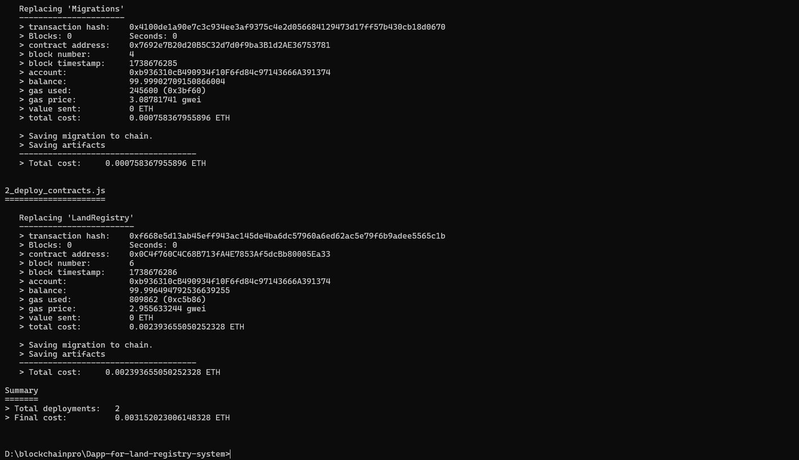
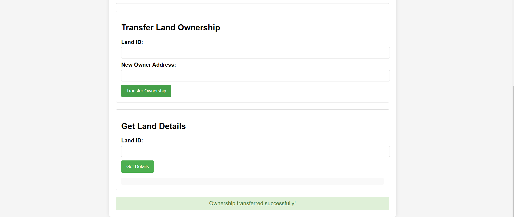
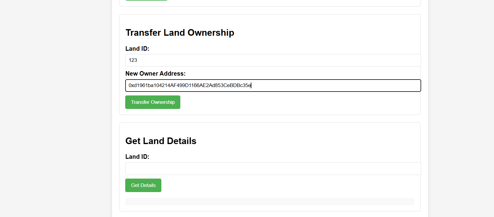
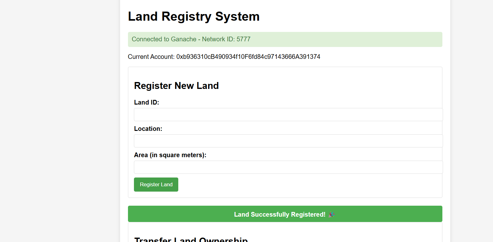
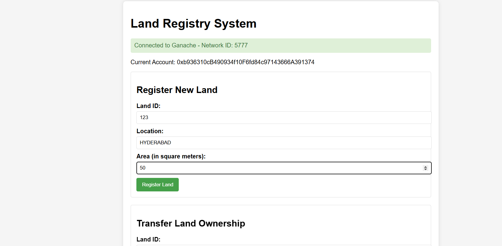
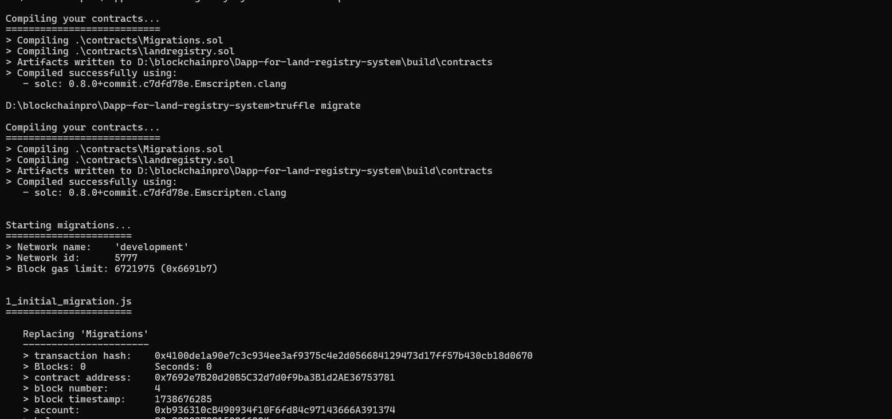

## **Land Registry System: A Decentralized Blockchain Solution for Land Ownership**

The **Land Registry System** is an advanced **decentralized application (DApp)** designed to modernize and secure the management of land ownership and transfer records through **Blockchain** technology. By leveraging the transparency, immutability, and security of the blockchain, this system removes the reliance on centralized authorities, effectively preventing fraud and ensuring trustworthy land transactions.

Powered by **Ethereum** and **Smart Contracts**, the system enables land transactions to occur swiftly and securely, providing both buyers and sellers with a reliable, transparent platform for managing land ownership.

---

### **Core Features**

- **Immutability and Security**:  
  Land ownership records are stored on the blockchain, making them tamper-proof. Once a record is added, it becomes permanent and immutable, eliminating the risk of fraudulent alterations.

- **Transparency and Trust**:  
  Every transaction and record is publicly visible on the blockchain, offering full transparency. This guarantees that any participant in the system can independently verify the status of land ownership.

- **Efficient Ownership Transfer**:  
  Land transactions are executed through **Smart Contracts**, which automatically enforce the terms and conditions between parties. This eliminates intermediaries, speeds up the process, and reduces the cost of transactions.

- **Smart Contract Automation**:  
  Smart contracts act as self-executing agreements. They automatically trigger actions such as the transfer of ownership when predefined conditions (e.g., payment completion) are met, ensuring a seamless and secure transaction.

- **Decentralization**:  
  The decentralized nature of the blockchain ensures that no single entity controls the records, reducing the risk of corruption, fraud, and errors.

---

### **How It Works**

1. **Land Registration**:
   - Property owners can register their land by submitting detailed information such as land location, size, and ownership. This information is securely recorded and verified on the blockchain.
   
2. **Ownership Transfer**:
   - Once an agreement is made, the transaction is initiated by the **buyer** and **seller** via a **smart contract**. The contract automatically verifies payment and ownership details before finalizing the transfer. This removes the need for traditional notaries or middlemen.

3. **Land Record Search**:
   - Users can easily search for any land record using a unique **Land ID** or property identifier. The blockchain’s transparency allows anyone to access up-to-date, verified ownership information.

---

### **Technology Stack**

- **Blockchain**:  
  - **Ethereum**: The platform for decentralized applications, ensuring the immutability and security of all records. Ethereum’s ability to execute **smart contracts** makes it the ideal solution for managing land ownership records.

- **Smart Contracts**:  
  - Written in **Solidity**, these self-executing contracts ensure that land transactions are executed exactly as agreed upon. These contracts are the backbone of the Land Registry System, enabling seamless and secure property transfers.

- **Backend Framework**:  
  - **Truffle**: A powerful framework for developing, testing, and managing Ethereum smart contracts. Truffle helps deploy smart contracts to the Ethereum blockchain with ease.

- **Frontend**:  
  - Developed using **HTML**, **CSS**, and **JavaScript**, the frontend interacts with the Ethereum blockchain through **Web3.js**. This enables users to perform actions like registering land, transferring ownership, and searching land records directly from their browser.

---

### **Benefits**

- **Eliminates Fraud**:  
  Blockchain’s immutable nature ensures that once a record is added, it cannot be altered, protecting against fraudulent claims of land ownership.

- **Speeds Up Transactions**:  
  Smart contracts automate and enforce transaction rules, reducing the time required to complete land deals, and eliminating delays due to intermediaries.

- **Cost-Effective**:  
  Without the need for middlemen such as banks, notaries, or registrars, the cost of transactions is significantly reduced.

- **Transparent & Verifiable**:  
  All records are stored publicly on the blockchain, providing anyone with access to the system the ability to verify the land’s ownership and transaction history.

- **Scalable**:  
  The system can handle large volumes of transactions and can be scaled to serve various regions, making it a global solution for land registration.

---

### **Installation and Setup**

#### **Prerequisites**:

Before running the Land Registry System, you’ll need the following tools installed:

1. **Node.js**  
   [Download and install Node.js](https://nodejs.org/), which is required to manage project dependencies and run the backend.

2. **Truffle Framework**  
   Install **Truffle** globally to manage smart contract development and deployment:
   ```bash
   npm install -g truffle
   ```

3. **Ganache**  
   Download and install [Ganache](https://www.trufflesuite.com/ganache), a personal Ethereum blockchain used for testing smart contracts locally.

---

### **Steps to Run the Land Registry System**

1. **Clone the Repository**:
   - Start by cloning the repository to your local machine:
     ```bash
     git clone <repository-url>
     cd <project-folder>
     ```

2. **Install Dependencies**:
   - Install all necessary dependencies using npm:
     ```bash
     npm install
     ```

3. **Launch Ganache**:
   - Open **Ganache** to create a personal Ethereum blockchain for development and testing. Ganache allows you to deploy contracts and simulate real-world conditions.

4. **Compile the Smart Contracts**:
   - Run the following command to compile the smart contracts:
     ```bash
     truffle compile
     ```

5. **Deploy Smart Contracts**:
   - Deploy the smart contracts to the local Ethereum blockchain with Truffle:
     ```bash
     truffle migrate
     ```

6. **Start the Frontend**:
   - Use **Live Server** in **Visual Studio Code** or another HTTP server to serve the frontend files. This allows users to interact with the blockchain directly via a browser.
   
---

<p align="center">
  
</p>

<p align="center">
  
</p>

<p align="center">
  
</p>

<p align="center">
  
</p>

<p align="center">
  
</p>

<p align="center">
  
</p>


### **Conclusion**

The **Land Registry System** introduces a groundbreaking solution for land ownership and transaction management. By harnessing the power of **Ethereum** and **Smart Contracts**, this system offers an immutable, transparent, and highly efficient way to manage land records. The elimination of intermediaries, fraud prevention, and automation of transactions will not only streamline the process but also bring a new level of security and trust to land dealings.

With the installation steps provided, you can quickly set up and experiment with the system in your local development environment. The decentralized nature of the blockchain ensures that the system is secure, tamper-proof, and scalable, making it ideal for global implementation.
